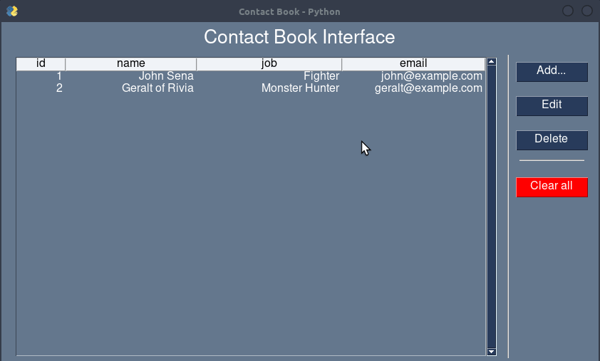

# Contact Book

This software is developed in Python using [PySimpleGUI](https://www.pysimplegui.org/en/latest/) for the GUI and [SQLite3](https://www.sqlite.org/index.html) for storage data.



# Python Dependencies

I just use PySimpleGUI: `$ pip install PySimpleGUI`

# How to run

```console
$ python app.py
```

# References

**Inspired by:** [https://realpython.com/python-contact-book/](https://realpython.com/python-contact-book/)
